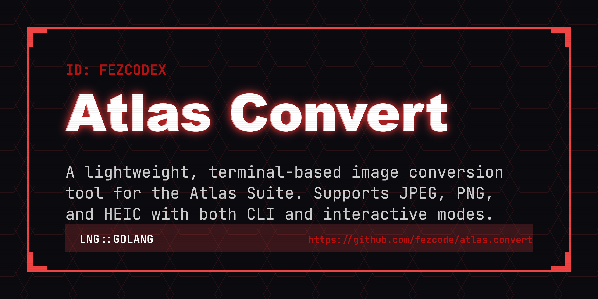

# Atlas Convert



> [!IMPORTANT]
> **atlas.convert** is part of the **Atlas Suite**—a collection of high-visibility, local-first terminal utilities designed for power users who demand precision and aesthetic clarity.

**atlas.convert** is a high-performance image conversion tool that simplifies media workflows directly from your terminal. Whether you're batch-processing assets for a project or quickly converting a single HEIC photo from your phone, Atlas Convert provides a seamless, dependency-free experience with the signature Atlas aesthetic.


## ✨ Key Features

- 🖼️ **Format Support:** Seamlessly convert between **JPEG**, **PNG**, and **HEIC** (Decoding).
- 🔄 **Batch Processing:** Convert entire directories or sets of files using glob patterns.
- 🏷️ **Smart Placeholders:** Customize output filenames with `{name}`, `{idx}`, and `{date}` tokens.
- 🕹️ **Interactive Mode:** A guided, step-by-step TUI prompt for users who prefer not to memorize flags.
- ⚡ **Blazing Fast:** Written in Go with native imaging libraries for near-instantaneous conversion.
- 🍎 **HEIC Support:** Includes built-in decoding for modern iPhone/macOS image formats without needing external system libraries.
- 🎨 **Aesthetic CLI:** Clean, high-contrast output consistent with the Atlas Suite design language.
- 📦 **Zero Dependencies:** Compiles to a single, static binary—no `imagemagick` or `ffmpeg` required.

## 🚀 Installation

### Using Gobake (Recommended)
This project uses the Atlas **gobake** orchestration tool for cross-platform builds.

```bash
git clone https://github.com/fezcode/atlas.convert
cd atlas.convert
gobake build
```
The compiled binary will be located in the `build/` directory.

## ⌨️ Usage

### Batch Conversion with Globs
Convert all HEIC images in a folder to PNG:
```bash
atlas.convert -s "*.heic" -d "converted/" -t png
```

### Pattern-based Renaming
Convert PNGs to JPEGs with a specific naming convention:
```bash
atlas.convert -s "raw/*.png" -d "web/{name}_optimized.jpg" -t jpeg
```

### Using Indexed Sequences
Convert images and number them sequentially:
```bash
atlas.convert -s "snapshots/" -d "archived/IMG_{idx}.png" -f jpg -t png
```

### Options & Flags

| Flag | Shorthand | Description |
|------|-----------|-------------|
| `--source` | `-s` | Source path (file, directory, or glob pattern) |
| `--destination` | `-d` | Destination path (directory or pattern with placeholders) |
| `--from` | `-f` | Source codec/format (jpeg, png, heic) |
| `--to` | `-t` | Destination codec/format (jpeg, png) |
| `--interactive` | `-i` | Launch the interactive guided mode |
| `--help` | `-h` | Print help text and usage examples |
| `--version` | `-v` | Print current version |

### 🏷️ Supported Placeholders
When using `-d`, you can use these tokens to dynamically generate filenames:
- `{name}`: The original filename without its extension.
- `{idx}`: The sequence index (0, 1, 2...) during batch processing.
- `{date}`: The current date in `YYYY-MM-DD` format.

## 🛠️ Supported Formats

| Format | Read (Decode) | Write (Encode) |
|--------|:-------------:|:--------------:|
| **JPEG** | ✅ | ✅ |
| **PNG** | ✅ | ✅ |
| **HEIC** | ✅ | ❌ (Coming soon) |

## 🏗️ Architecture & Philosophy

- **Local-First:** All processing happens on your machine. Your photos never touch the cloud.
- **Precision:** Uses high-quality resampling and encoding parameters to ensure no loss in visual fidelity during conversion.
- **Portability:** Built with pure Go (WASM-based decoder) to ensure the tool works across all major operating systems with zero setup and no CGO requirements.

## 📄 License
MIT License - Copyright (c) 2026 FezCode.
